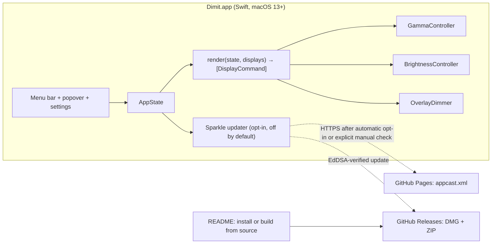
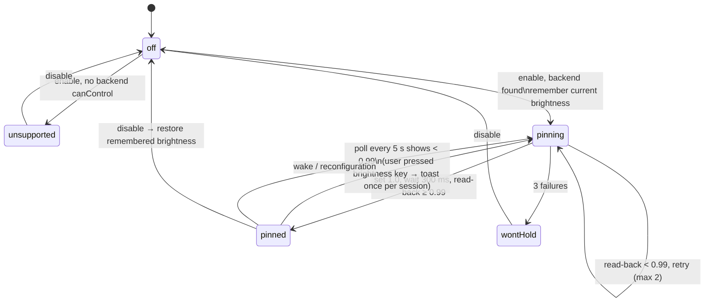

# Dimit — Architecture

Companion to `CLAUDE.md` (product rules and API-level detail) and `docs/PLAN.md` (schedule). This file describes the app architecture and distribution pipeline. Change it before changing code.

**Scope (2026-09-10):** §1–§2 describe the display engine; §3 covers scheduling; §4 defines free MIT distribution and opt-in Sparkle updates; §9 covers the release pipeline; §10–§12 cover UI, testing and remaining engineering questions. Surviving section numbers are retained for code references. `docs/PLAN.md` tracks cycles C0–C7.

## 1. System context



Network policy: **the app makes no request by default**. Sparkle may fetch the GitHub Pages appcast and release assets only after automatic-check opt-in or an explicit one-off manual check (§4). No activation calls, analytics or telemetry; no application server.

## 2. App module map and layering

Dependencies point downwards only. A layer never imports a layer above it.

```
UI            MenuBarController, PopoverView, SettingsView, OnboardingView
              ↓ observes
State         AppState (ObservableObject), PresetStore, Persistence (UserDefaults, debounced)
              ↓ calls
Features      PWMSafeCoordinator, ScheduleEngine/ScheduleCoordinator, HotkeyManager, UpdateController (C7)
              ↓ calls
Display       DisplayManager, WarmthCurve (pure), Renderer (pure), GammaController,
              BrightnessController (protocol BrightnessBackend), OverlayDimmer, DDCController
              ↓ wraps
Backends      CoreGraphics gamma API · DisplayServices.framework (dlopen) · CoreDisplay.framework (dlopen)
              · IOKit (IORegistry read, IOAVService I2C for DDC) · AppKit windows for overlay
```

Rules that keep this testable:

- Everything under **Display** that does math is a pure function with unit tests: `WarmthCurve.rgb(kelvin:)`, `GammaMath.table(orig:mul:dim:)`, `Renderer.render(state:displays:)`.
- Every private-API call lives in exactly one file, behind a protocol, returning `.unsupported` when a symbol is missing. Files: `BrightnessController.swift` (DisplayServices, CoreDisplay), `DDCController.swift` (IOAVService), nothing else.
- `AppState` is the only mutable source of truth. UI mutates it; a single `apply()` pipeline reacts to it. No UI code calls a controller directly.

### 2.1 The apply pipeline

```swift
struct DisplayCommand: Equatable {
    let display: CGDirectDisplayID
    var gamma: GammaSpec?          // multipliers (r,g,b) and dim ∈ [0.30, 1]; nil = restore
    var overlayAlpha: Double       // 0 = no overlay window; the overlay is always black (dim floor)
    var hardwareBrightness: Float? // 1.0 while PWM pinned; nil = leave alone
}

func render(_ s: AppState, _ displays: [DisplayInfo]) -> [DisplayCommand]
```

`render` is pure and idempotent. `Applier` diffs the new command list against the last applied one and calls controllers only for changed fields. That is what keeps idle CPU under 0.5% and slider latency under 50 ms: sliders change `AppState` at most every 16 ms, `render` is cheap, and `CGSetDisplayTransferByTable` is called once per changed display.

### 2.2 Display lifecycle events

| Event | Source | Action |
|---|---|---|
| Display added/removed/resolution change | `CGDisplayRegisterReconfigurationCallback` (flags contain `.beginConfiguration` → wait for the end flag) | re-enumerate, drop cached baselines for gone displays, read baselines for new ones, re-apply after 300 ms debounce |
| Wake from sleep | `NSWorkspace.didWakeNotification`, `screensDidWakeNotification` | re-apply after 1.0 s; PWM re-pin |
| App quit | `applicationWillTerminate` | restore gamma, close overlays, restore hardware brightness if pinned |
| SIGTERM / SIGINT | signal handlers installed at launch | `CGDisplayRestoreColorSyncSettings()` then exit |
| Crash (SIGSEGV etc.) | not handled | WindowServer keeps the last table; onboarding and Settings have a "Restore colours" button, and the app restores on next launch before doing anything else |

### 2.3 Warmth curve

`WarmthCurve.rgb(kelvin: Double) -> (r: Double, g: Double, b: Double)`

- `k ∈ [1000, 6500]`: Tanner Helland CCT approximation, normalised so 6500 K = (1, 1, 1).
- `k ∈ [0, 1000)`: linear interpolation from `rgb(1000)` to `(1, 0, 0)`. At 0: exactly `(1, 0, 0)`.
- Tests: the known points listed in CLAUDE.md §3.2, monotonic decrease of g and b as k falls, `rgb(0) == (1,0,0)` exactly.

### 2.4 Gamma tables

```
for i in 0..<n:
    x        = i / (n - 1)
    r[i]     = clamp(origR[i] * mulR * dim, 0, 1)   // same for g, b
```

- `origR/G/B` are read once per display at first touch (`CGGetDisplayTransferByTable`) and cached as the restore baseline keyed by display UUID, not by ID (IDs change across reconnects).
- `dim ∈ [0.30, 1.0]`. Below 0.30 the overlay takes over: `overlayAlpha = 1 - brightness / 0.30`, gamma dim stays at 0.30.
- After each set, read back and compare; a mismatch logs `gammaMismatch` and increments a counter shown in diagnostics. A match proves nothing on macOS 26+ (Apple bugs FB19136488, FB22273730), which is why the popover offers the "Colours not changing?" help there — the user's own eyes are the only available detector. Fallback mode was removed on 2026-09-10 and the automatic banner on 2026-09-11; see CLAUDE.md §3.3 for both and for the Apple forum evidence.

### 2.5 Brightness backends

```swift
protocol BrightnessBackend {
    var name: String { get }                 // for diagnostics
    func canControl(_ d: DisplayInfo) -> Bool
    func get(_ d: DisplayInfo) -> Float?     // 0...1
    func set(_ d: DisplayInfo, _ v: Float) -> BackendResult   // .ok | .unsupported | .failed(code)
}
```

Resolution order per display, first that `canControl` wins:

1. `DisplayServicesBackend` — `dlopen("/System/Library/PrivateFrameworks/DisplayServices.framework/DisplayServices")`, symbols `DisplayServicesGetBrightness`, `DisplayServicesSetBrightness`. Apple displays only.
2. `CoreDisplayBackend` — `CoreDisplay_Display_GetUserBrightness` / `SetUserBrightness`. Fallback for Apple displays.
3. `DDCBackend` (C5b, experimental, default OFF) — VCP 0x10 over `IOAVService` I2C on Apple Silicon, `IOI2CSendRequest` on Intel. Third-party monitors.
4. `IORegistryReadOnlyBackend` — reads `IODisplayParameters.brightness` under `AppleARMBacklight` (observed on the dev machine: min 0, max 65536). `set` returns `.unsupported`; used only to cross-check that a pin held when backend 1 or 2 cannot read back.

Rate limit: one `set` per display per 250 ms, coalesced.

### 2.6 PWM-Safe state machine (per display)



While any display is `pinned`, the Brightness slider maps entirely to gamma `dim` plus the overlay. The 5 s poll runs only while at least one display is `pinned`; the timer is invalidated otherwise.

**As built in C3, with one disclosed simplification** (this file is the contract, so it says what the code does, not what an earlier draft intended): the `pinned → pinning : wake / reconfiguration` edge above is *not* a separate immediate hook. Wake and reconfiguration are caught by the same 5 s drift poll that catches a brightness-key press, so a re-pin can lag a wake by up to one poll interval. Gamma gets an immediate 1.0 s re-apply (§2.2) because a visibly wrong *colour* for a second is jarring; a backlight still at its pre-sleep level for a few more seconds is a much smaller cost than the extra wake-specific plumbing it would take to shave it. Revisit if beta testers actually notice it.

Two further C3 details worth pinning down here, both from code review rather than the original design:

- **Every retry is delayed**, including the ones whose failure is known synchronously (a `set()` that reports failure, or an unreadable initial brightness). CLAUDE.md §3.4's "never call set-brightness more than 4×/second" would otherwise be violated by three back-to-back `set()` calls in a single run-loop turn.
- **A display whose current brightness can't be read is not pinned at all.** There would be nothing to restore it to afterwards, and a backlight stuck at 100% with no way back is worse than no PWM-Safe.
- **Restoring the remembered brightness happens on quit too**, not just on toggling PWM-Safe off. The pin is real hardware state set through DisplayServices; it outlives the process.

### 2.7 Overlay windows

One `NSWindow` per screen, created lazily, keyed by display UUID. Properties from CLAUDE.md §3.5, plus:

- `sharingType = .none` set **before** `orderFront` (setting it afterwards is unreliable on some versions).
- Recreated, not moved, on reconfiguration. Frame equals `NSScreen.frame` including the notch area.
- One use: black with alpha for extreme dim. (A second, red-tinted use — Fallback mode, gamma left at baseline — existed from C3 until 2026-09-10, when the maintainer removed the mode as too confusing.)

### 2.8 Persistence and secrets

| Data | Where | Key |
|---|---|---|
| `AppState` (everything user-visible) | `UserDefaults.standard`, JSON blob, written 250 ms after the last change | `state.v1` |
| Gamma baselines | memory only, never persisted (stale baselines would bake a tint in) | |
| Sparkle's own bookkeeping (last check date, skipped version) | `UserDefaults.standard`, written by Sparkle itself | `SU*` keys |
| Logs | `os_log`, subsystem `app.dimit.mac`; the last 200 lines are read back through `OSLogStore` for diagnostics | |

The installed app uses no Keychain secret or persistent install identifier (§4). The release-signing key belongs only on the maintainer's build machine.

## 3. Scheduling engine

`ScheduleEngine` is a pure function over time plus a small driver:

```swift
struct SchedulePhase { let preset: PresetID; let start: Date; let rampMinutes: Int }
func phases(for day: Date, mode: ScheduleMode, location: Coordinate?, bedtime: TimeOfDay) -> [SchedulePhase]
func target(at now: Date, phases: [SchedulePhase]) -> (warmthK: Double, brightness: Double)
```

- Sunrise/sunset via the NOAA algorithm; tested against Tashkent 2026-09-08 within ±3 min.
- Location from CoreLocation only if the user pressed "Use my location"; otherwise the bundled city list; otherwise manual lat/lon.
- The driver wakes once per minute (a `Timer` tolerance of 30 s keeps energy impact nil) and during a ramp every 10 s, sets `AppState.warmthK/brightness` with `source = .schedule` so a manual slider move pauses the schedule until the next phase boundary.

**As built in C5** (this file is the contract, so it records what shipped where it differs from or extends the sketch above):

- **Three phases, not the two CLAUDE.md §3.8 spells out.** Its prose only names DAY→EVENING at sunset and EVENING→NIGHT at bedtime; a third, back to DAY at sunrise, is this cycle's reading of what the mode's own name — "Sunset→Sunrise" — has to mean for the feature to make sense at all (otherwise the screen stays warm all day once night ends). `Fixed times` mode is the same three-phase shape with user-set clock times instead of computed sunrise/sunset.
- **`target()` DOES control ON/OFF — a corrected decision, not the original one.** A first version had every mode return only warmth/brightness, keeping the user's ON/OFF toggle fully independent, reasoning that an automatic mode switching itself on unprompted (mid screen-share, say) was the worse surprise. An independent review found the real consequence: once a user turned the filter on under a non-manual schedule, there was no state it could ever reach that looked like "off" again — even the sunrise phase just held `isOn=true` at a permanent, unexplained tint forever. A mode literally named "Sunset→Sunrise" that can never actually stop at sunrise defeats the one thing its name promises. The schedule's own `.day` phase now means genuinely off (`isOn=false`, neutral values) once its ramp completes — `PresetID.day`'s own values (4000K/100%, a mild daytime warmth) stay reachable only as a manual preset button, never as what an automatic schedule settles on. Manually toggling ON/OFF is treated exactly like a slider drag: a manual override that pauses the schedule until the next phase boundary.
- **`activePreset` is re-set once a ramp settles exactly on a preset's values**, not left permanently `nil`. `warmthK`/`brightness`'s own `didSet` unconditionally clears `activePreset` on every write (C4), so a schedule ticking those fields every 10–60s left the popover's DAY/EVENING/NIGHT picker blank for as long as the schedule ran, with no way back — an independent review caught this by tracing the actual `didSet` chain, not by running the app. `ScheduleCoordinator.evaluateNow()` now re-assigns `activePreset` last (same "set last, unconditionally" pattern `AppState.apply(preset:)` already uses) whenever `ScheduleEngine.target()` reports the ramp has landed exactly on a preset; mid-ramp it correctly stays `nil`, same as a manual slider drag.
- **No `source` field on `AppState`.** The sketch above proposes tagging a write `source = .schedule`; the shipped mechanism instead has `ScheduleCoordinator` set a private flag immediately around its own writes (now four: `isOn`, `warmthK`, `brightness`, `activePreset`) and treat any change to the first three that arrives *without* that flag set as a manual override. This trades a small amount of robustness for not adding a field `AppState` itself has no other use for: the guard depends on the Combine subscription it protects staying fully synchronous (no `.receive(on:)`/`.debounce`/`.throttle`), which `ScheduleCoordinator.swift`'s own comment on the flag calls out explicitly as a constraint on any future edit to that subscription.
- **`target()` takes an injected `values: (PresetID) -> PresetValues` closure, never `PresetID.defaultValues` directly.** A user who customized EVENING in Settings (C4) gets *their* EVENING from the schedule, not the factory one — `ScheduleEngineTests.test_target_usesInjectedValues_notHardcodedDefaults` pins this after a C4 review flagged the stale `PresetID.warmthK`/`.brightness` accessors as exactly this footgun for whichever cycle built scheduling.
- **Phase start times are forced chronological** (`ScheduleEngine.chronological(_:)`) — `phases`/`target` pick the active phase by comparing raw start times, so a bedtime configured earlier than sunset (an ordinary configuration at high latitudes in summer — nothing invalid about wanting to sleep before dark) let EVENING's later clock time permanently outrank a NIGHT phase that had already begun, for the rest of the night. Found by an independent review's line-by-line pass and reproduced with a real city (London, midsummer) before being accepted. Any phase whose configured or computed start would sort at or before the one before it is nudged one second later instead.
- **The `$scheduleConfig` Combine subscription uses `.receive(on: .main)`.** `@Published` fires from `willSet`, before the new value is stored, and `handleConfigChanged()` reads `appState.scheduleConfig` itself rather than the value the publisher carried — a synchronous sink would see the *previous* config. `DisplayCoordinator` hit this exact bug already (see its own doc comment) and fixed it the same way; missing it here was reproduced directly by an independent review: switching live from Manual to a real mode in Settings silently did nothing until a second, unrelated config change happened to also fire the subscription.
- **The driver's timer runs in `.common` run-loop mode from the start**, not `.default`. A `.default`-mode timer stops firing while a menu is open or a window is being dragged — the independent C4 review found precisely this bug in `PWMSafeCoordinator`'s drift poll; that fix landed alongside this one rather than being carried forward a second time (see the PWM entry below).
- **No timer at all in Manual mode** (the default for every install). CLAUDE.md §8's idle-CPU budget shouldn't pay for a repeating wakeup nobody asked for.
- **`ScheduleCoordinator.stop()` is called from `applicationWillTerminate`, before the gamma-restore calls.** Without it, a tick already queued on the run loop could fire between the restore and the process actually exiting, re-tinting the display on the way out — the same "every coordinator with a live Timer needs an explicit teardown hook" lesson `PWMSafeCoordinator.restoreAndDisable()` already exists for, generalized here rather than reintroduced.
- **`PWMSafeCoordinator`'s drift-poll timer also switched to `.common` mode in this cycle** (`Dimit/Features/PWMSafeCoordinator.swift`), closing the docs/QA.md item carried forward from C4 — `ScheduleCoordinator` needed the fix anyway, so applying it to its sibling coordinator in the same pass cost one line instead of a fourth review cycle rediscovering it.
- **`ScheduleConfig`/`TimeOfDay`/`Coordinate` all have hand-written `decodeIfPresent`-per-field decoders**, matching `PersistedState`'s own. `Persistence`'s outer `decodeIfPresent(ScheduleConfig.self, forKey:)` only protects against the *key* being absent; it does nothing once decoding starts and a field *inside* the nested struct turns out to be missing. Without this, the next field added to any of the three (a schedule feature is likely to grow one) would reintroduce the "one new key wipes every existing user's entire saved state" bug this codebase has already hit and fixed twice.
- **The NOAA algorithm was derived from first principles, not transcribed from memory**, after two wrong transcriptions each passed an initial sanity check anyway (one swapped sunrise and sunset outright; a first "fix" put both events 9+ hours off) — see `SolarCalculator.swift`'s own comment on the final formula. Verified against two independent references before trusting it: Tashkent 2026-09-08 (±3 min per CLAUDE.md §8) and London's 2026-12-21 winter solstice — then re-verified against this machine's real system clock and timezone for the current date, and independently reproduced a third time by a reviewer with no access to the other two verifications.

## 4. Distribution and updates

Dimit is **free and open source under the MIT licence**, copyright **2026 Azizullo Temirov**. The README is the product page. [GitHub Releases](https://github.com/azakapro/dimit/releases) distributes the DMG and the Sparkle ZIP; users can also build from source. No account, activation, licence key, feature gate or application server is required.

- **Sparkle is the only network-capable app feature.** `updateChecksEnabled` and `SUEnableAutomaticChecks` default to `false`. Automatic checks require explicit opt-in in onboarding or Settings. Choosing "Check for Updates…" explicitly consents to one check, without changing the automatic setting. Without either action, Sparkle must make no request; verify with a network monitor.
- Feed: `SUFeedURL = https://azakapro.github.io/dimit/appcast.xml`. `scripts/make_appcast.sh` generates `docs/appcast.xml`; configure GitHub Pages to serve the repository's `docs/` folder. Keeping the small feed beside the release documentation makes changes reviewable without a second branch or a separate build pipeline. ZIP enclosure URLs point to GitHub Release assets, keeping binaries out of the repository.
- Sparkle verifies each update's EdDSA signature. `SUPublicEDKey` belongs in Info.plist; the private signing key stays in the maintainer's login Keychain and is never committed. Sparkle and KeyboardShortcuts are the only external app dependencies, pre-approved by CLAUDE.md §2.
- Upload the DMG and ZIP from the same built app to a GitHub Release before publishing the feed entry. Keep old assets available for existing appcast entries. Release instructions must state actual signing and notarization status; ad-hoc builds remain usable through the documented installation steps.
- No accounts, analytics, telemetry, crash reporter, device identifier or email collection in the app. Logs use `os_log`; diagnostics are assembled locally and copied to the user's clipboard for review. The app never transmits them (CLAUDE.md §4.2).
- Optional Buy Me a Coffee support belongs only in the README, buys no features, and has no app UI or network integration.

## 9. Release pipeline

As built in C6 (`docs/RELEASE.md` is the step-by-step):

1. `scripts/build.sh` — `xcodebuild archive` + export with the Developer ID when `DIMIT_SIGN_IDENTITY`/`DIMIT_TEAM_ID` are set, ad-hoc otherwise; universal; hardened runtime; fails the build if the app carries any entitlement. Regenerates the Xcode project first. Emits `Dimit.app` and a `.zip`.
2. `scripts/notarize.sh` — in this order, because the ticket has to be on the app before it is sealed into an image: notarize + staple the app → re-zip it for Sparkle → `scripts/build_dmg.sh` from the stapled app → notarize + staple the DMG. Refuses ad-hoc builds.
3. `scripts/build_dmg.sh` — `hdiutil` image with an Applications symlink, mounted and checked after creation (contents, signature). No `create-dmg`, no background: cosmetics don't justify a dependency (CLAUDE.md §7 "As built in C6").
4. `scripts/make_appcast.sh` — Sparkle `generate_appcast` with the EdDSA private key from the Keychain; output `docs/appcast.xml`, with enclosure URLs pointing to GitHub Release ZIP assets.
5. Attach the DMG and ZIP to the GitHub Release, verify the asset URLs, then publish `docs/appcast.xml` through GitHub Pages (§4). Until notarization is available, disclose that limitation in the release notes and README.
6. Version `MAJOR.MINOR`; build number = UTC `YYYYMMDDHHMM`, generated by `build.sh` and read back from the built app by every later step (never from `project.yml`, so a premature bump can't mislabel an artifact). Tag `vX.Y`. GitHub Releases is the public download source.

The release scripts share `scripts/lib.sh` (output directory, version lookup, signature checks).

## 10. UI design spec (no Figma; build this directly)

Principles: native controls where accessibility matters (sliders, toggles), custom only for the two hero elements (the ON button and the warmth track). Follow the system appearance. Every string from the catalog. Fits 1.4× English width.

**Popover, 320 × ~440 pt:**

1. Header row: app name left, status pill right ("PWM ✓" when pinned), gear button.
2. ON/OFF: full-width 56 pt button, filled with a warm gradient when ON (`#FF6A00 → #FF2D2D`), outlined when OFF. Label from `main.on` / `main.off`.
3. Warmth: label left, value right ("2700K" / "2700 K" per locale). Native `Slider` 0…6500 with a custom track gradient from white (6500) through amber (2700) to red (0). Snaps to 100 K steps.
4. Brightness: same row layout, 10…100 %, track from black to white.
5. Presets: three-segment picker DAY / EVENING / NIGHT; the active one highlighted; editing presets lives in Settings.
6. PWM-Safe row: toggle with the help text as a `?` popover; status text below in the states from CLAUDE.md §3.6.
7. Footer: the PWM-Safe status line from CLAUDE.md §3.6 when it has something to say, otherwise nothing. There is no licence, trial or account state to show (§4).

**Menu bar icon:** a 16 pt circle, half-filled diagonally ("dim"). Outline when OFF, filled when ON, 3 pt dot at the lower right when PWM pinned. Template image so it follows the menu bar tint.

**Settings window (tabs):** General (launch at login, language, updates opt-in, hotkeys, presets), Schedule, Displays (per-display list with backend name and DDC experimental toggle), Advanced (restore colours, copy diagnostics). No License tab — there is nothing to license (§4).

**Onboarding (3 steps, first launch only):** headline, screenshots-stay-normal, no-account-no-tracking with the updates opt-in checkbox and a "Restore colours" safety button.

Typography: SF Pro, values in SF Mono for the two numbers so they do not jitter. Corner radius 10 pt. Dark and light both supported by using semantic colours only.

**As built in C4** (this file is the contract, so it records what the code does where that differs from the sketch above):

- **Settings tabs shipped: General, Displays, Advanced**, plus **Schedule from C5** (see that cycle's "As built" note below). The Displays tab lists each display with its real brightness-backend name; **C5b added the Experimental DDC toggle**, so that line is now complete. Preset editing (CLAUDE.md §3.7 "user-editable; reset to defaults") lives in General, since no tab above names it.
- **The settings window is our own `NSWindow`, not SwiftUI's `Settings {}` scene.** Opening that scene programmatically needs `openSettings` (macOS 14+) or an undocumented selector whose name Apple has changed between releases; CLAUDE.md §2 fixes the target at macOS 13. Same result for the user, none of the version risk.
- **Language override applies live, without relaunch.** CLAUDE.md §5 says "set Bundle on relaunch"; instead `AppState.effectiveLocale` is applied with `.environment(\.locale, …)` at every SwiftUI root (popover, settings, onboarding), which is how `Text` resolves String Catalog lookups. AppKit surfaces (right-click menu, window titles, toast) go through `AppState.localized(_:)`, which sets the resource's locale before `String(localized:)`. Verified by rendering all three surfaces off-screen in en/uz/ru (`DimitTests/LayoutRenderTests`).
- **Onboarding completion is recorded on "Get Started" or a user-initiated close only** (`windowShouldClose`), never on app termination — first found by a probe where SIGTERM during step 1 marked the intro as done.
- **Launch at login has no persisted mirror.** `SMAppService.mainApp.status` is the source of truth (survives reboot, visible in System Settings); `LaunchAtLogin` is a thin wrapper so the toggle has one testable surface.
- **`updateChecksEnabled` was introduced as a stored preference in C4.** C7 connects it to Sparkle; it defaults to off (CLAUDE.md §1.2 opt-in).
- **Global hotkeys** are `KeyboardShortcuts` (pre-approved in CLAUDE.md §2), Carbon `RegisterEventHotKey` underneath — no Accessibility or Input Monitoring prompt. The handlers are one-line calls into `AppState` (`cycleToNextPreset`, `adjustWarmth`, `adjustBrightness`), which is where the logic and the tests are; the registration layer itself has no fake to inject and is deliberately untested.

## 11. Testing strategy

| Level | What | Where |
|---|---|---|
| Unit (Swift) | `WarmthCurve`, gamma math, `render`, `ScheduleEngine` NOAA values, `PWMSafeCoordinator` with a fake backend | `DimitTests` |
| Manual matrix | CLAUDE.md §8 rows | `docs/QA.md`, one row per machine × macOS × display |
| Performance | idle CPU, popover open time, slider latency | recorded in `docs/QA.md` per release |

`docs/QA.md` was created in C0 with the gamma spike results as its first two rows, and every cycle since has added a section. Its **pending** rows are the standing list of what no unattended session can verify.

## 12. Open questions to resolve during build

- Auto-brightness detection on macOS 26/27: no public key found on the dev machine (2026-09-08). Timeboxed in C3, nothing reliable found. The consequence was an unconditional banner on macOS ≥ 26, which on 2026-09-11 became an unconditional *offer* of help (a collapsed disclosure) instead — closed, kept here as the reason.
- The exact home monitor model for DDC; record it in QA.md the first time it is tested (C6).
