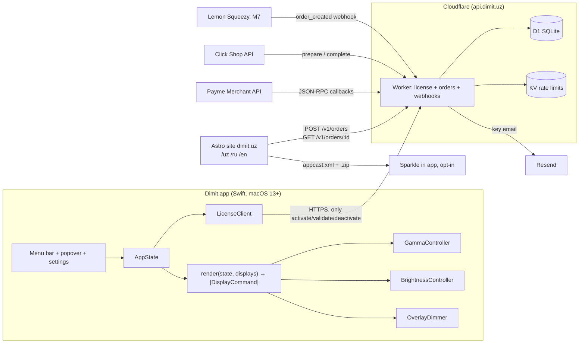
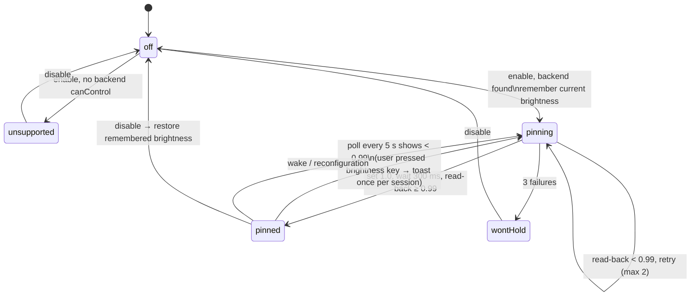
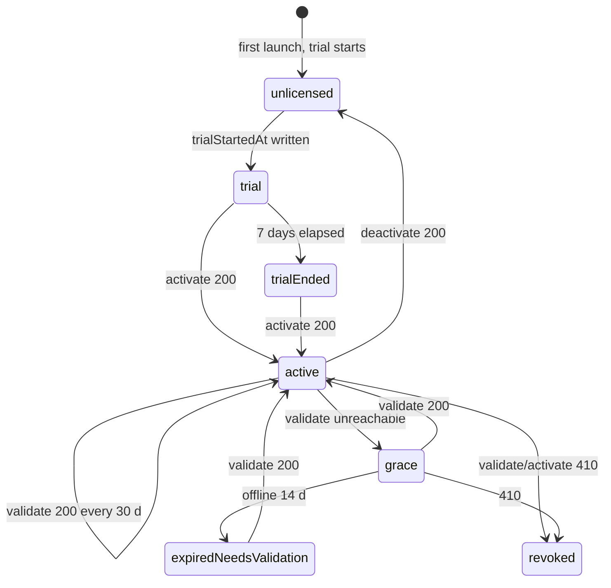
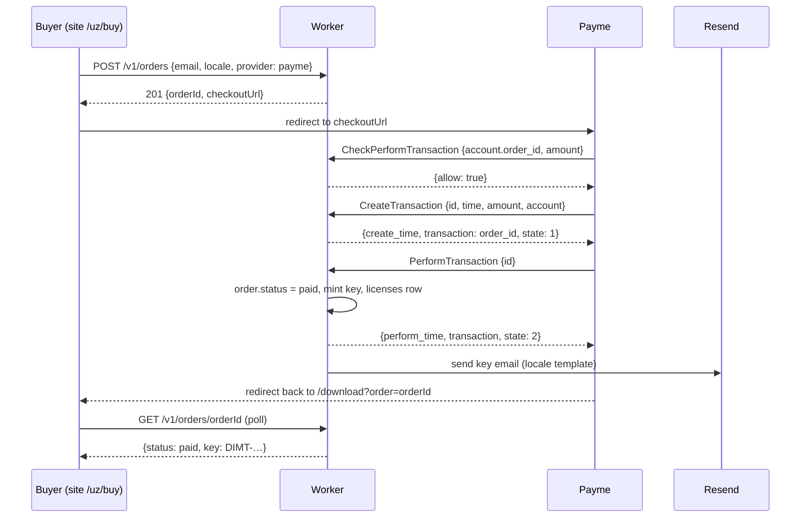

# Dimit — Architecture

Companion to `CLAUDE.md` (product rules and API-level detail) and `docs/PLAN.md` (schedule). This file is the contract between the app track and the server/site track. Change it before changing code.

**MVP scope (2026-09-09):** cycles C0–C3 implement §1 (app box only), §2 in full, and §10–§11. §3 (schedule) is C5. §4 (license client) is C7. §5–§8 (server, orders, payments, site) are C7–C8; until then there is no network code in the app. §9 (release pipeline) is C6.

## 1. System context



Network policy: the app talks to exactly one host, `api.dimit.uz`, and only for license calls; Sparkle talks to `dimit.uz` only when the user opted in. Nothing else, ever.

## 2. App module map and layering

Dependencies point downwards only. A layer never imports a layer above it.

```
UI            MenuBarController, PopoverView, SettingsView, OnboardingView, LicenseView
              ↓ observes
State         AppState (@Observable), PresetStore, Persistence (UserDefaults, debounced)
              ↓ calls
Features      PWMSafeCoordinator, ScheduleEngine, HotkeyManager, LicenseClient/LicenseState
              ↓ calls
Display       DisplayManager, WarmthCurve (pure), Renderer (pure), GammaController,
              BrightnessController (protocol BrightnessBackend), OverlayDimmer, DDCController
              ↓ wraps
Backends      CoreGraphics gamma API · DisplayServices.framework (dlopen) · CoreDisplay.framework (dlopen)
              · IOKit (IORegistry read, IOAVService I2C for DDC) · AppKit windows for overlay
```

Rules that keep this testable:

- Everything under **Display** that does math is a pure function with unit tests: `WarmthCurve.rgb(kelvin:)`, `GammaMath.table(orig:mul:dim:)`, `Renderer.render(state:displays:)`.
- Every private-API call lives in exactly one file, behind a protocol, returning `.unsupported` when a symbol is missing. Files: `BrightnessController.swift` (DisplayServices, CoreDisplay), `DDCController.swift` (IOAVService), nothing else.
- `AppState` is the only mutable source of truth. UI mutates it; a single `apply()` pipeline reacts to it. No UI code calls a controller directly.

### 2.1 The apply pipeline

```swift
struct DisplayCommand: Equatable {
    let display: CGDirectDisplayID
    var gamma: GammaSpec?          // multipliers (r,g,b) and dim ∈ [0.30, 1]; nil = restore
    var overlayAlpha: Double       // 0 = no overlay window
    var overlayTint: OverlayTint   // .black (extreme dim) or .red(warmth) in Fallback mode
    var hardwareBrightness: Float? // 1.0 while PWM pinned; nil = leave alone
}

func render(_ s: AppState, _ displays: [DisplayInfo]) -> [DisplayCommand]
```

`render` is pure and idempotent. `Applier` diffs the new command list against the last applied one and calls controllers only for changed fields. That is what keeps idle CPU under 0.5% and slider latency under 50 ms: sliders change `AppState` at most every 16 ms, `render` is cheap, and `CGSetDisplayTransferByTable` is called once per changed display.

### 2.2 Display lifecycle events

| Event | Source | Action |
|---|---|---|
| Display added/removed/resolution change | `CGDisplayRegisterReconfigurationCallback` (flags contain `.beginConfiguration` → wait for the end flag) | re-enumerate, drop cached baselines for gone displays, read baselines for new ones, re-apply after 300 ms debounce |
| Wake from sleep | `NSWorkspace.didWakeNotification`, `screensDidWakeNotification` | re-apply after 1.0 s; PWM re-pin |
| App quit | `applicationWillTerminate` | restore gamma, close overlays, restore hardware brightness if pinned |
| SIGTERM / SIGINT | signal handlers installed at launch | `CGDisplayRestoreColorSyncSettings()` then exit |
| Crash (SIGSEGV etc.) | not handled | WindowServer keeps the last table; onboarding and Settings have a "Restore colours" button, and the app restores on next launch before doing anything else |
| License becomes `revoked` | `LicenseClient` | `isOn = false`, restore |

### 2.3 Warmth curve

`WarmthCurve.rgb(kelvin: Double) -> (r: Double, g: Double, b: Double)`

- `k ∈ [1000, 6500]`: Tanner Helland CCT approximation, normalised so 6500 K = (1, 1, 1).
- `k ∈ [0, 1000)`: linear interpolation from `rgb(1000)` to `(1, 0, 0)`. At 0: exactly `(1, 0, 0)`.
- Tests: the known points listed in CLAUDE.md §3.2, monotonic decrease of g and b as k falls, `rgb(0) == (1,0,0)` exactly.

### 2.4 Gamma tables

```
for i in 0..<n:
    x        = i / (n - 1)
    r[i]     = clamp(origR[i] * mulR * dim, 0, 1)   // same for g, b
```

- `origR/G/B` are read once per display at first touch (`CGGetDisplayTransferByTable`) and cached as the restore baseline keyed by display UUID, not by ID (IDs change across reconnects).
- `dim ∈ [0.30, 1.0]`. Below 0.30 the overlay takes over: `overlayAlpha = 1 - brightness / 0.30`, gamma dim stays at 0.30.
- After each set, read back and compare; a mismatch logs `gammaMismatch` and increments a counter shown in diagnostics. A match proves nothing on macOS 26+ (Apple bugs FB19136488, FB22273730), which is why Fallback mode exists and the auto-brightness banner is shown.

### 2.5 Brightness backends

```swift
protocol BrightnessBackend {
    var name: String { get }                 // for diagnostics
    func canControl(_ d: DisplayInfo) -> Bool
    func get(_ d: DisplayInfo) -> Float?     // 0...1
    func set(_ d: DisplayInfo, _ v: Float) -> BackendResult   // .ok | .unsupported | .failed(code)
}
```

Resolution order per display, first that `canControl` wins:

1. `DisplayServicesBackend` — `dlopen("/System/Library/PrivateFrameworks/DisplayServices.framework/DisplayServices")`, symbols `DisplayServicesGetBrightness`, `DisplayServicesSetBrightness`. Apple displays only.
2. `CoreDisplayBackend` — `CoreDisplay_Display_GetUserBrightness` / `SetUserBrightness`. Fallback for Apple displays.
3. `DDCBackend` (M4, experimental) — VCP 0x10 over `IOAVService` I2C on Apple Silicon, `IOI2CSendRequest` on Intel. Third-party monitors.
4. `IORegistryReadOnlyBackend` — reads `IODisplayParameters.brightness` under `AppleARMBacklight` (observed on the dev machine: min 0, max 65536). `set` returns `.unsupported`; used only to cross-check that a pin held when backend 1 or 2 cannot read back.

Rate limit: one `set` per display per 250 ms, coalesced.

### 2.6 PWM-Safe state machine (per display)



While any display is `pinned`, the Brightness slider maps entirely to gamma `dim` plus the overlay. The 5 s poll runs only while at least one display is `pinned`; the timer is invalidated otherwise.

**As built in C3, with one disclosed simplification** (this file is the contract, so it says what the code does, not what an earlier draft intended): the `pinned → pinning : wake / reconfiguration` edge above is *not* a separate immediate hook. Wake and reconfiguration are caught by the same 5 s drift poll that catches a brightness-key press, so a re-pin can lag a wake by up to one poll interval. Gamma gets an immediate 1.0 s re-apply (§2.2) because a visibly wrong *colour* for a second is jarring; a backlight still at its pre-sleep level for a few more seconds is a much smaller cost than the extra wake-specific plumbing it would take to shave it. Revisit if beta testers actually notice it.

Two further C3 details worth pinning down here, both from code review rather than the original design:

- **Every retry is delayed**, including the ones whose failure is known synchronously (a `set()` that reports failure, or an unreadable initial brightness). CLAUDE.md §3.4's "never call set-brightness more than 4×/second" would otherwise be violated by three back-to-back `set()` calls in a single run-loop turn.
- **A display whose current brightness can't be read is not pinned at all.** There would be nothing to restore it to afterwards, and a backlight stuck at 100% with no way back is worse than no PWM-Safe.
- **Restoring the remembered brightness happens on quit too**, not just on toggling PWM-Safe off. The pin is real hardware state set through DisplayServices; it outlives the process.

### 2.7 Overlay windows

One `NSWindow` per screen, created lazily, keyed by display UUID. Properties from CLAUDE.md §3.5, plus:

- `sharingType = .none` set **before** `orderFront` (setting it afterwards is unreliable on some versions).
- Recreated, not moved, on reconfiguration. Frame equals `NSScreen.frame` including the notch area.
- Two uses: black with alpha for extreme dim, and red-tinted with alpha derived from warmth in Fallback mode. In Fallback mode gamma is left at baseline.

### 2.8 Persistence and secrets

| Data | Where | Key |
|---|---|---|
| `AppState` (everything user-visible) | `UserDefaults(suiteName: "app.dimit.mac")`, JSON blob, written 250 ms after last change | `state.v1` |
| Gamma baselines | memory only, never persisted (stale baselines would bake a tint in) | |
| License key, `instanceId`, `validUntil`, `lastValidated` | Keychain, service `app.dimit.mac.license` | one item, JSON |
| Device ID | Keychain, service `app.dimit.mac.device` | SHA-256(IOPlatformUUID + home path), hex |
| Trial start | Keychain (survives reinstall; UserDefaults would be trivially reset) | `trialStartedAt` |
| Logs | `~/Library/Logs/Dimit/dimit.log`, ring of 200 lines in memory for diagnostics | |

## 3. Scheduling engine

`ScheduleEngine` is a pure function over time plus a small driver:

```swift
struct SchedulePhase { let preset: PresetID; let start: Date; let rampMinutes: Int }
func phases(for day: Date, mode: ScheduleMode, location: Coordinate?, bedtime: TimeOfDay) -> [SchedulePhase]
func target(at now: Date, phases: [SchedulePhase]) -> (warmthK: Double, brightness: Double)
```

- Sunrise/sunset via the NOAA algorithm; tested against Tashkent 2026-09-08 within ±3 min.
- Location from CoreLocation only if the user pressed "Use my location"; otherwise the bundled city list; otherwise manual lat/lon.
- The driver wakes once per minute (a `Timer` tolerance of 30 s keeps energy impact nil) and during a ramp every 10 s, sets `AppState.warmthK/brightness` with `source = .schedule` so a manual slider move pauses the schedule until the next phase boundary.

## 4. License client state machine



Feature gating: `trial` and `active` and `grace` have everything. `trialEnded` and `expiredNeedsValidation` keep warmth and dim but disable PWM-Safe and scheduling and show a persistent bar. `revoked` turns the filter off and shows the localized message.

Validation timing: on launch if `now - lastValidated > 30 d`, then retry with exponential backoff (1 h, 4 h, 24 h) while unreachable. Never more than one request in flight. All requests carry `appVersion` and `platform`, nothing else identifying beyond `deviceId`.

## 5. Server: Cloudflare Worker

Stack: TypeScript, Hono router, D1 via prepared statements, KV for rate limits, Vitest with `@cloudflare/vitest-pool-workers`. Deployed at `api.dimit.uz`. Secrets via `wrangler secret`: `PAYME_KEY`, `PAYME_TEST_KEY`, `CLICK_SECRET_KEY`, `RESEND_API_KEY`, `LS_WEBHOOK_SECRET` (M7), `ADMIN_TOKEN`.

### 5.1 Schema (`server/schema.sql`)

```sql
CREATE TABLE licenses (
  key         TEXT PRIMARY KEY,             -- DIMT-XXXX-XXXX-XXXX-XXXX
  email       TEXT NOT NULL,
  source      TEXT NOT NULL CHECK (source IN ('payme','click','ls','manual')),
  order_ref   TEXT,                         -- orders.id or LS order id
  seats       INTEGER NOT NULL DEFAULT 3,
  status      TEXT NOT NULL DEFAULT 'active' CHECK (status IN ('active','revoked')),
  created_at  INTEGER NOT NULL              -- unix ms
);
CREATE TABLE activations (
  instance_id   TEXT PRIMARY KEY,
  key           TEXT NOT NULL REFERENCES licenses(key),
  device_id     TEXT NOT NULL,
  device_name   TEXT NOT NULL,
  platform      TEXT NOT NULL,              -- 'mac' | 'win'
  activated_at  INTEGER NOT NULL,
  last_seen     INTEGER NOT NULL,
  UNIQUE (key, device_id)                   -- re-activating the same device reuses the seat
);
CREATE TABLE orders (
  id            TEXT PRIMARY KEY,           -- 12-char base32, used as Payme account / Click merchant_trans_id
  email         TEXT NOT NULL,
  telegram      TEXT,
  locale        TEXT NOT NULL,              -- 'uz' | 'ru' | 'en'
  provider      TEXT NOT NULL CHECK (provider IN ('payme','click','ls')),
  amount_tiyin  INTEGER NOT NULL,           -- UZS * 100
  status        TEXT NOT NULL DEFAULT 'pending' CHECK (status IN ('pending','paid','cancelled')),
  license_key   TEXT REFERENCES licenses(key),
  created_at    INTEGER NOT NULL,
  paid_at       INTEGER
);
CREATE TABLE payme_transactions (
  id            TEXT PRIMARY KEY,           -- Payme's transaction id
  order_id      TEXT NOT NULL REFERENCES orders(id),
  state         INTEGER NOT NULL,           -- 1 created, 2 performed, -1 cancelled, -2 cancelled after perform
  create_time   INTEGER NOT NULL,           -- Payme "time" field
  perform_time  INTEGER NOT NULL DEFAULT 0,
  cancel_time   INTEGER NOT NULL DEFAULT 0,
  reason        INTEGER
);
CREATE TABLE click_transactions (
  click_trans_id  TEXT PRIMARY KEY,
  order_id        TEXT NOT NULL REFERENCES orders(id),
  prepare_id      INTEGER NOT NULL,
  status          TEXT NOT NULL,            -- 'prepared' | 'completed' | 'cancelled'
  created_at      INTEGER NOT NULL
);
-- M7
CREATE TABLE affiliates (handle TEXT PRIMARY KEY, payout_method TEXT, rate REAL NOT NULL DEFAULT 0.25);
CREATE TABLE referrals  (order_ref TEXT, handle TEXT, amount INTEGER, created_at INTEGER);
```

### 5.2 Routes

| Route | Auth | Notes |
|---|---|---|
| `POST /v1/orders` | none, rate-limited 10/min/IP | validates email + locale + provider, computes amount from `config.priceUZS`, returns `checkoutUrl` (see §7) |
| `GET /v1/orders/:id` | none, rate-limited 60/min/IP | returns `status` and, when paid, `key`. The id is unguessable (12 base32 chars) and the page stops polling after 15 min |
| `POST /v1/activate` | none, rate-limited 20/min/IP and 20/day/key | seat logic: same `device_id` → reuse row; else if `count < seats` → insert; else 409 with the device list |
| `POST /v1/validate` | none | 200 with fresh `validUntil = now + 90 d`; 410 if revoked; 404 if instance unknown |
| `POST /v1/deactivate` | none | deletes the activation row |
| `POST /webhooks/payme` | HTTP Basic `Paycom:<PAYME_KEY>` | JSON-RPC 2.0, §7.1 |
| `POST /webhooks/click` | `sign_string` MD5, §7.2 | form-encoded |
| `POST /webhooks/lemonsqueezy` | HMAC-SHA256 header | M7 |
| `POST /admin/mint` | `Authorization: Bearer ADMIN_TOKEN` | used by `scripts/mint.ts` for Teams and manual sales |
| `GET /r/:handle` | none | M7 affiliate redirect |

Key generation: 20 random bytes → Crockford base32 → 4 groups of 4 after `DIMT-`. Uniqueness enforced by the primary key; retry once on collision.

Logging: request path, status, latency, SHA-256 of the key (first 12 hex chars), never the key, never the email, never the IP beyond the KV rate-limit bucket (which expires in 24 h).

### 5.3 Errors returned to the app

All errors are `{ error: "<code>" }` with codes `invalid_key`, `no_seats`, `revoked`, `unknown_instance`, `rate_limited`. The app maps each to a String Catalog key; no server text is ever shown to the user.

## 6. Order and key lifecycle



Click follows the same shape with `prepare` (validate order, return `merchant_prepare_id`) and `complete` (mark paid, mint, email).

Refunds and revocations: `CancelTransaction` with state 2 → state −2, order `cancelled`, license `revoked`. Manual refunds through Click or a card dispute: `scripts/revoke.ts <key>`. The app sees `revoked` on its next validation.

## 7. Payment provider protocols

Verify every detail below against the official docs before M3 ends: Payme at `developer.help.paycom.uz`, Click at `docs.click.uz`. The PayTechUZ library (`docs.pay-tech.uz`) is a good second reference for edge cases and error codes.

### 7.1 Payme Merchant API (JSON-RPC 2.0, single endpoint)

- Auth: `Authorization: Basic base64("Paycom:" + PAYME_KEY)`; test environment uses `PAYME_TEST_KEY`. Wrong or missing → error `-32504`.
- Amounts are in **tiyin** (UZS × 100). Mismatch → `-31001`.
- Account field: `account.order_id`. Unknown order → `-31050` (any code in −31050…−31099 is "account not found" class).
- Checkout URL: `https://checkout.paycom.uz/` + base64(`m=<merchant_id>;ac.order_id=<orderId>;a=<amount_tiyin>;l=<uz|ru|en>;c=<return_url>`). Test: `https://test.paycom.uz/`.
- Methods and required behaviour:

| Method | Must do |
|---|---|
| `CheckPerformTransaction` | order exists and is `pending`, amount matches → `{allow: true}`; may also return `detail.receipt_type` and items for fiscalisation (add when Payme asks). |
| `CreateTransaction` | if a transaction with this `id` exists → return its current state (idempotent). Else if the order already has a live transaction → `-31008`. Else if `now - time > 12 h` → `-31008`. Else insert state 1. |
| `PerformTransaction` | state 1 → set state 2, `perform_time = now`, mark order paid, mint key, send email. State 2 → return the stored result (idempotent). State −1/−2 → `-31008`. |
| `CancelTransaction` | state 1 → −1; state 2 → −2 and revoke the license (Payme only allows this if the goods are returnable; we say yes, 30-day refund policy). Store `reason`. |
| `CheckTransaction` | return `create_time`, `perform_time`, `cancel_time`, `transaction`, `state`, `reason`. |
| `GetStatement` | transactions with `create_time` in `[from, to]`. |

Test cases for Vitest (Codex writes these before the merchant contract lands): wrong auth; wrong amount; unknown order; create twice with same id; create when another transaction is live; perform twice; cancel before and after perform; statement window.

### 7.2 Click Shop API

- Two form-encoded POSTs to the same URL: `action=0` (prepare) and `action=1` (complete).
- Signature: `sign_string = md5(click_trans_id + service_id + SECRET_KEY + merchant_trans_id + [merchant_prepare_id, complete only] + amount + action + sign_time)`. Mismatch → `error: -1`.
- `merchant_trans_id` is our `orders.id`. Unknown → `-5`. Already paid → `-4`. Wrong amount → `-2`. Cancelled by Click (`error != 0` in complete) → `-9` and order `cancelled`.
- Prepare returns `{click_trans_id, merchant_trans_id, merchant_prepare_id, error: 0, error_note: "Success"}`; store `merchant_prepare_id` as the `click_transactions` row id.
- Checkout URL: `https://my.click.uz/services/pay?service_id=…&merchant_id=…&amount=<UZS with 2 decimals>&transaction_param=<orderId>&return_url=<download url>`.

### 7.3 Lemon Squeezy (M7)

`order_created` with `X-Signature` HMAC-SHA256 over the raw body → mint key with `source = 'ls'`, email via Resend using the store's checkout locale (`custom_data.locale` passed from the site). `order_refunded` → revoke.

## 8. Site (`site/`, Astro)

- Locales: `uz` at `/` (default for 1.0), `ru` at `/ru/`, `en` at `/en/`. At M7 the default flips to `en` on dimit.app while dimit.uz keeps `uz`.
- Pages per locale: home, buy, download, faq, help, science, changelog, terms, privacy, refund (affiliates at M7).
- `/buy`: one form (email, optional Telegram), two buttons Payme / Click. Submits to `POST /v1/orders`, redirects to `checkoutUrl`. No JavaScript framework; a 40-line inline script.
- `/download?order=…`: polls `GET /v1/orders/:id` every 5 s for up to 15 min, shows the key, the DMG link and the activation steps. Also reached from the key email.
- Config in `site/src/config.ts`: `priceUZS`, `priceUSD`, `apiBase`, `telegram`, `supportEmail`, `legalEntity`. Footer renders the last three.
- Hosting: Cloudflare Pages, `appcast.xml` and release `.zip` files under `/updates/`.
- Analytics: Cloudflare Web Analytics (cookieless) only.

## 9. Release pipeline

1. `scripts/build.sh` — `xcodebuild archive` universal, Developer ID signing, hardened runtime.
2. `scripts/notarize.sh` — `notarytool submit --wait`, `stapler staple`, on both `.app` and `.dmg`.
3. `scripts/build_dmg.sh` — `create-dmg`, background, Applications symlink.
4. `scripts/make_appcast.sh` — Sparkle `generate_appcast` with the EdDSA private key from Keychain; uploads to `site/public/updates/`.
5. Version `MAJOR.MINOR`, build number = date `YYYYMMDDHH`. Tag `vX.Y`.

## 10. UI design spec (no Figma; build this directly)

Principles: native controls where accessibility matters (sliders, toggles), custom only for the two hero elements (the ON button and the warmth track). Follow the system appearance. Every string from the catalog. Fits 1.4× English width.

**Popover, 320 × ~440 pt:**

1. Header row: app name left, status pill right ("PWM ✓" when pinned, "Trial · 5 d" when in trial), gear button.
2. ON/OFF: full-width 56 pt button, filled with a warm gradient when ON (`#FF6A00 → #FF2D2D`), outlined when OFF. Label from `main.on` / `main.off`.
3. Warmth: label left, value right ("2700K" / "2700 K" per locale). Native `Slider` 0…6500 with a custom track gradient from white (6500) through amber (2700) to red (0). Snaps to 100 K steps.
4. Brightness: same row layout, 10…100 %, track from black to white.
5. Presets: three-segment picker DAY / EVENING / NIGHT; the active one highlighted; editing presets lives in Settings.
6. PWM-Safe row: toggle with the help text as a `?` popover; status text below in the states from CLAUDE.md §3.6.
7. Footer: one line, either "Trial: 5 days left · Buy" or "Licensed · 1 of 3 Macs" or the offline/grace text.

**Menu bar icon:** a 16 pt circle, half-filled diagonally ("dim"). Outline when OFF, filled when ON, 3 pt dot at the lower right when PWM pinned. Template image so it follows the menu bar tint.

**Settings window (tabs):** General (launch at login, language, updates opt-in, hotkeys), Schedule, Displays (per-display list with backend name and DDC experimental toggle), License, Advanced (Fallback mode, restore colours, copy diagnostics).

**Onboarding (3 steps, first launch only):** headline, screenshots-stay-normal, no-account-no-tracking with the updates opt-in checkbox and a "Restore colours" safety button.

Typography: SF Pro, values in SF Mono for the two numbers so they do not jitter. Corner radius 10 pt. Dark and light both supported by using semantic colours only.

## 11. Testing strategy

| Level | What | Where |
|---|---|---|
| Unit (Swift) | `WarmthCurve`, gamma math, `render`, `LicenseState` transitions incl. grace, `ScheduleEngine` NOAA values, `PWMSafeCoordinator` with a fake backend | `DimitTests` |
| Unit (TS) | every route and every Payme/Click case in §7 | `server/test` |
| Manual matrix | CLAUDE.md §8 rows | `docs/QA.md`, one row per machine × macOS × display |
| Performance | idle CPU, popover open time, slider latency | recorded in `docs/QA.md` per release |

`docs/QA.md` is created in M0 with the gamma spike results as its first two rows.

## 12. Open questions to resolve during build

- Auto-brightness detection on macOS 26/27: no public key found on the dev machine (2026-09-08). Timebox 2 h in M2, then fall back to the unconditional banner.
- Whether Xcode 26 runs on the macOS 27 beta on the dev machine, or the 27 beta of Xcode is required.
- Payme fiscalisation (`detail` in `CheckPerformTransaction`): required only for some merchant categories; ask Payme during onboarding.
- The exact home monitor model for DDC; record it in QA.md the first time it is tested.
